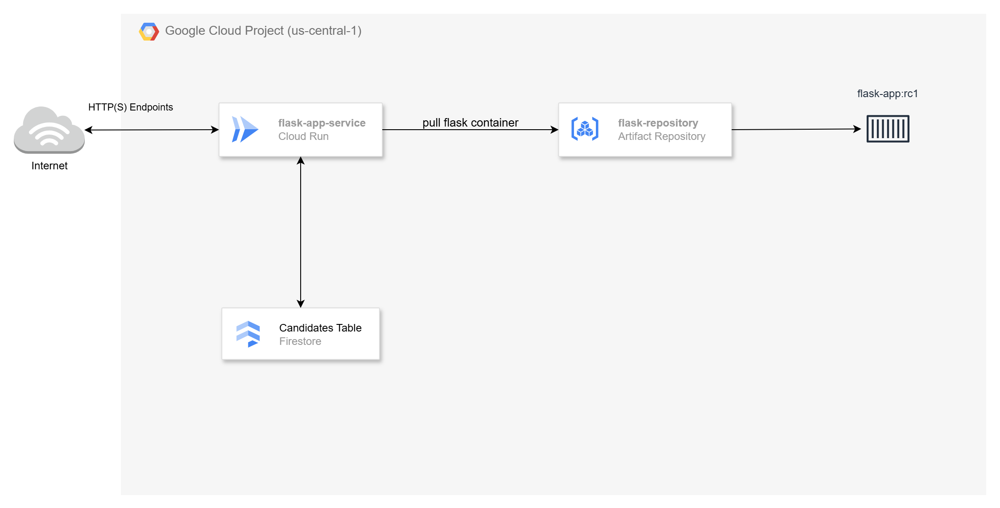
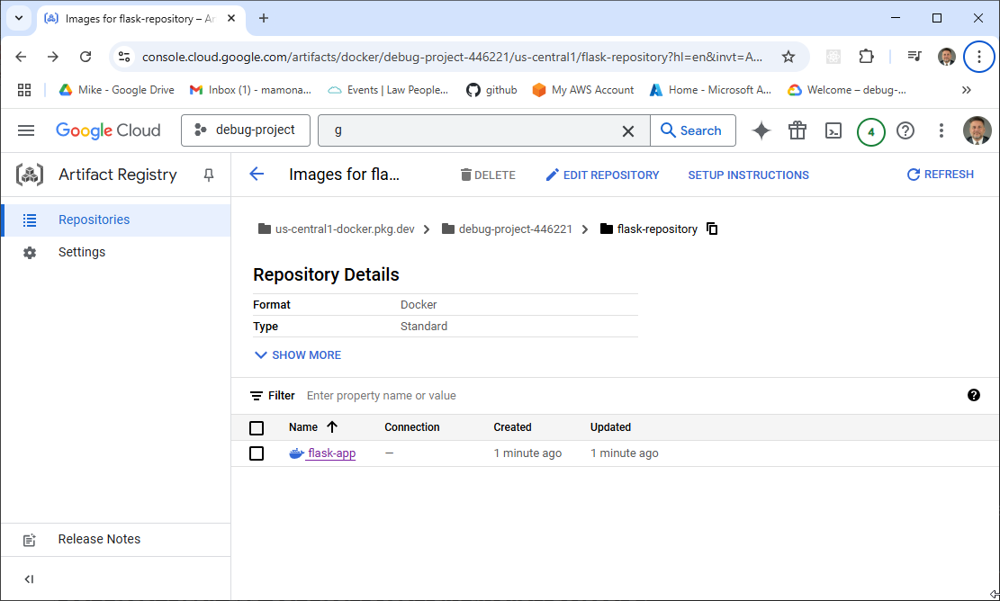
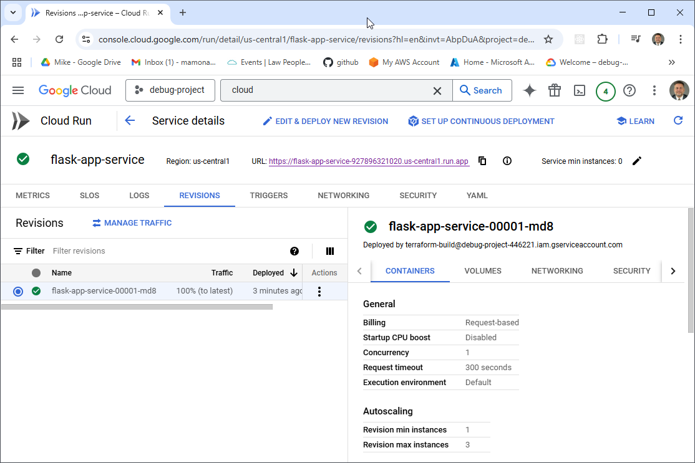

# Deploying Simple Containers in GCP

Welcome to **Video 3** of the [Simple Containers Series](https://www.youtube.com/@MikesCloudSolutions), where we’ll focus on containerizing a Python-based microservice and deploying it with **GCP Cloud Run**. This video complements the [GCP Managed Instance Groups](https://www.youtube.com/watch?v=AAOZOhREc5o) video, where we deployed Flask microservices using **Virtual Machines** and **Managed Instance Groups**. That same microservice will be packaged as a container and deployed with **GCP Cloud Run**.

### In This Video, We'll:

- Use **Google Firestore** for persistent data storage
- **Containerize** the Python microservice using **Docker**  
- **Push** the container image to **Google Artifact Registry (GAR)**  
- **Deploy** the container as a **GCP Cloud Run** service  

## Google Artifact Registry: Simplifying Container Image Management

**Google Artifact Registry (GAR)** is a fully managed container registry provided by Google Cloud. It allows you to store, manage, and deploy container images securely and at scale. GAR integrates seamlessly with Google Cloud services like **Cloud Run**, **Google Kubernetes Engine (GKE)**, and **App Engine**, making it easy to deploy containerized applications.

### **Key Features:**
- **Private & Public Repositories:** Store container images securely with fine-grained access control.
- **Integration with CI/CD:** Easily integrates with GitHub Actions, Cloud Build, and Jenkins for automated deployments.
- **High Availability:** Google Cloud manages replication, durability, and scaling behind the scenes.
- **Security:** Supports encryption at rest and in transit, plus Identity and Access Management (IAM)-based access control.

### **How It Works:**
1. **Build** your Docker image locally or in a CI/CD pipeline.
2. **Tag** the image with your GAR repository URL.
3. **Push** the image to GAR using Docker CLI or automation tools.
4. **Pull** the image from GAR to deploy in services like Cloud Run, GKE, or App Engine.

## Google Cloud Run: Effortless Deployment for Containerized Applications

**Google Cloud Run** is a fully managed compute platform that enables you to deploy and run containerized applications and APIs effortlessly. Cloud Run abstracts away infrastructure management, automatically handling scaling, load balancing, and deployments.

### **Key Features:**
- **Simple Deployment:** Deploy directly from Google Artifact Registry (GAR), GitHub, or any container registry with minimal configuration.
- **Automatic Scaling:** Automatically scales up or down based on incoming traffic, including scaling to zero during idle periods to save costs.
- **Built-in Load Balancing:** Distributes incoming requests without requiring separate load balancer configuration.
- **Secure by Default:** Provides HTTPS endpoints out of the box, supports environment variables encryption, and integrates with Identity and Access Management (IAM) for secure access to Google Cloud services.

### **How It Works:**
1. **Source:** Connect to a container image from Google Artifact Registry (GAR) or a source code repository (Cloud Build can build and deploy it for you).
2. **Configure:** Define runtime settings such as environment variables, CPU/memory allocation, and concurrency settings.
3. **Deploy:** Cloud Run manages provisioning, load balancing, scaling, and monitoring automatically.
4. **Manage:** Monitor logs, metrics, and scaling behaviors through the Google Cloud Console, `gcloud` CLI, or Cloud Monitoring.



## Prerequisites

* [A Google Cloud Account](https://console.cloud.google.com/)
* [Install gcloud CLI](https://cloud.google.com/sdk/docs/install) 
* [Install Latest Terraform](https://developer.hashicorp.com/terraform/install)
* [Install Postman](https://www.postman.com/downloads/) for testing
* [Install Docker](https://docs.docker.com/engine/install/)

If this is your first time watching our content, we recommend starting with this video: [GCP + Terraform: Easy Setup](https://www.youtube.com/watch?v=3spJpYX4f7I). It provides a step-by-step guide to properly configure Terraform, Packer, and the gcloud CLI.

## Download this Repository

```bash
git clone https://github.com/mamonaco1973/gcp-flask-container.git
cd gcp-flask-container
```

## Build the Code

Run [check_env](check_env.sh) then run [apply](apply.sh).

```bash
~/gcp-flask-container$ ./apply.sh
NOTE: Validating that required commands are found in the PATH.
NOTE: gcloud is found in the current PATH.
NOTE: docker is found in the current PATH.
NOTE: terraform is found in the current PATH.
NOTE: All required commands are available.
NOTE: Validating credentials.json and test the gcloud command
Activated service account credentials for: [terraform-build@debug-project-446221.iam.gserviceaccount.com]
NOTE: Building GAR Instance.
Initializing the backend...
Initializing provider plugins...
- Finding latest version of hashicorp/google...
[...]
```

### **Build Process Overview**

The build process consists of three distinct phases:

#### 1. Create the Google Artifact Registry (GAR) Repository
- Creates a Google Artifact Registry (GAR) repository using Terraform to store Docker images.

#### 2. Build the Docker Image and Push It
- Builds the Flask Docker container and pushes the image to the GAR repository.

#### 3. Deploy to Google Cloud Run
- Deploys the Flask container to Google Cloud Run using Terraform.

#### Final Validation
- After the deployment completes, the `test_candidates.py` script is run to verify the solution and ensure everything is functioning as expected.

## Tour of Build Output in the GCP Console

- **The Artifact Registry**



- **The Cloud Run Deployment**

 
## Flask Endpoint Summary

- [Source Code](./02-docker/app.py)

### `/gtg` (GET)
- **Purpose**: Health check.
- **Response**: 
  - `{"connected": "true", "instance-id": <instance_id>}` (if `details` query parameter is provided).
  - 200 OK with no body otherwise.

### `/candidate/<name>` (GET)
- **Purpose**: Retrieve a candidate by name.
- **Response**: 
  - Candidate details (JSON) with status `200`.
  - `"Not Found"` with status `404` if no candidate is found.

### `/candidate/<name>` (POST)
- **Purpose**: Add or update a candidate by name.
- **Response**: 
  - `{"CandidateName": <name>}` with status `200`.
  - `"Unable to update"` with status `500` on failure.

### `/candidates` (GET)
- **Purpose**: Retrieve all candidates.
- **Response**: 
  - List of candidates (JSON) with status `200`.
  - `"Not Found"` with status `404` if no candidates exist.
