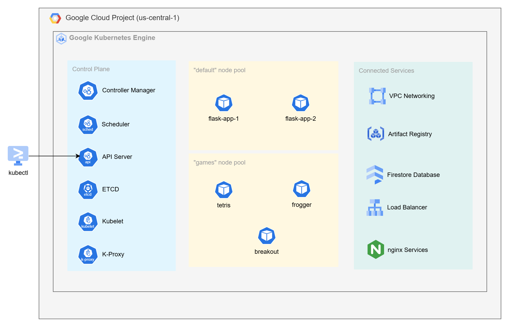
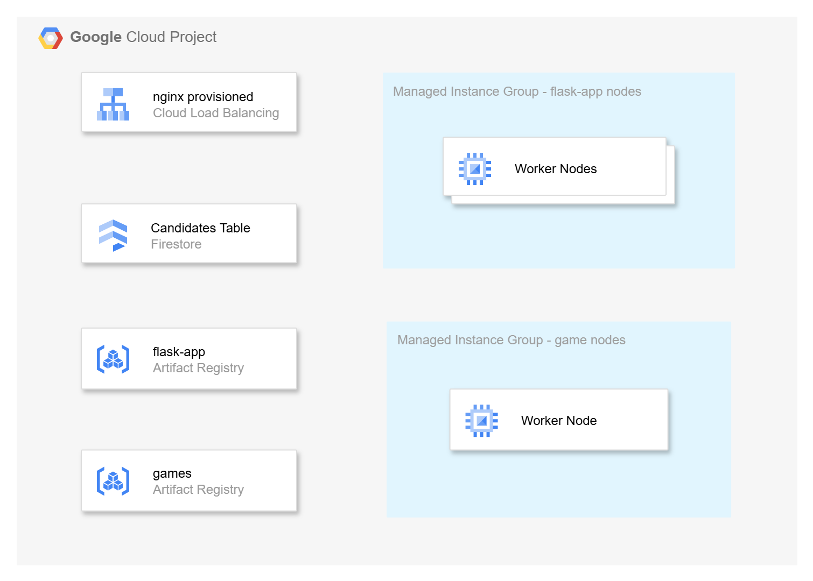
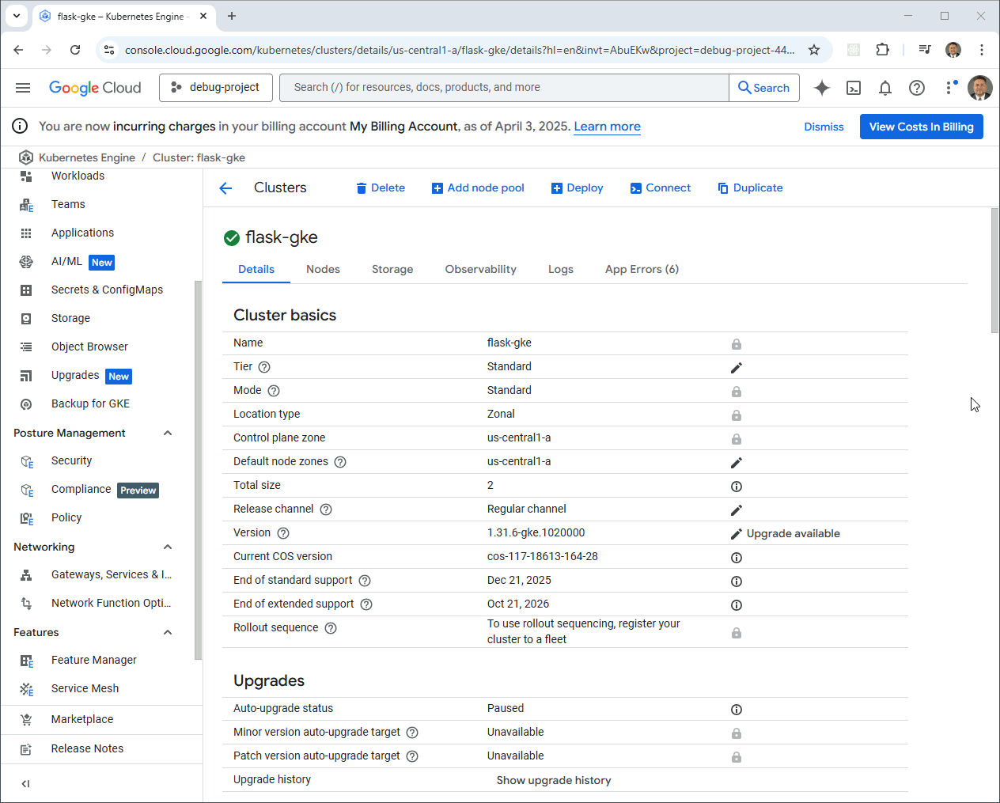

# Containerizing Applications with Google Kubernetes Engine (GKE)

Welcome to **Video 3** of the [Kubernetes In the Cloud](https://github.com/mamonaco1973/cloud-k8s-intro/blob/main/README.md) series.

**This video complements the [GCP Managed Instance Groups](https://github.com/mamonaco1973/gcp-flask-mig/blob/main/README.md) and the [Simple GCP Containers](hhttps://github.com/mamonaco1973/gcp-flask-container/blob/main/README.mdd) projects**, where we deployed a simple Python-based microservice using the Flask framework with different cloud services.

This is a **fully automated deployment** of containerized microservices and web apps with **Google Kubernetes Engine (GKE)** — powered by Terraform and shell scripting.

We'll build and deploy:

- **A document database-backed microservice** using:  
  - **Google Firestore** for fast, serverless NoSQL storage.

- **A Docker container** for the Flask microservice, optimized for deployment to **Google Kubernetes Engine (GKE)**.

- **Additional standalone Docker containers** that run classic games like:  
  - **[Tetris](https://gist.github.com/straker/3c98304f8a6a9174efd8292800891ea1)**  
  - **[Frogger](https://gist.github.com/straker/82a4368849cbd441b05bd6a044f2b2d3)**  
  - **[Breakout](https://gist.github.com/straker/98a2aed6a7686d26c04810f08bfaf66b)**

- **Cloud-native container registry workflows**, pushing all images to:  
  - **Google Artifact Registry**

- **Kubernetes workloads on GKE**, managing containerized applications at scale.

- **Kubernetes manifests** including **Deployments**, **Services**, and **Ingress** resources for scalable, fault-tolerant workloads.

- **NGINX as a unified Ingress controller**, exposing all services and games behind a single **Google Cloud Load Balancer**.

## Is Google Kubernetes Engine (GKE) PaaS or IaaS?

When deploying Kubernetes with **Google Kubernetes Engine (GKE)**, you might ask:

> Is GKE considered Infrastructure as a Service (IaaS) or Platform as a Service (PaaS)?

GKE lets you define compute, scaling, and networking options — that feels like IaaS. But it also manages the Kubernetes control plane, automates provisioning, and abstracts away much of the operational overhead — which leans toward PaaS.

The best answer: **GKE delivers a PaaS-like experience built on IaaS foundations**. It blends declarative APIs with Google Cloud’s native infrastructure provisioning.

---

### Managed Control Plane, Declarative Infrastructure

With **GKE**, you never install or manage the Kubernetes control plane. Google Cloud handles all of that for you — including:

- Control plane availability and scaling  
- Kubernetes version upgrades and patching  
- Integrated observability and security  

You don’t manually launch Compute Engine instances for nodes. Instead, you define node pool settings, and GKE provisions the necessary compute infrastructure for you — all through a **declarative, hands-off experience** that feels like PaaS.

---

### Autoscaling and Node Management: IaaS Under the Hood

While you don’t manage VMs directly, GKE uses **managed instance groups (MIGs)** to provision and scale worker nodes. You define:

- Machine types and disk sizes  
- Minimum and maximum node counts  
- Auto-scaling behavior based on workload metrics  

GCP then manages:

- VM provisioning and health checks  
- Auto-repair and rolling updates  
- Multi-zone and regional availability  

It’s all backed by traditional IaaS — just orchestrated through Kubernetes abstractions.

---

### Load Balancer Provisioning

GKE integrates tightly with Google Cloud Load Balancing. When you create a Kubernetes `Service` of type `LoadBalancer`, GCP automatically provisions a:

- **Global HTTP(S) Load Balancer** or **regional network load balancer**, depending on configuration and annotations.

You don’t need to manually configure health checks or backend services — the Kubernetes **GKE controller manager** handles that. This automation is a hallmark of PaaS: describe the service, and the infrastructure follows.

---

### Labels: The Glue Behind the Scenes

In GKE, **labels** are fundamental for organizing and orchestrating workloads across the cluster.

- Labels on nodes and pods guide **scheduling**, **autoscaling**, and **resource selection**.
- Labels on Services and Ingress resources help define **routing behavior** and enable dynamic **load balancer provisioning**.
- Labels also integrate with **IAM policies**, **cost tracking**, and **monitoring tools** for unified management.

Defined declaratively in your Kubernetes manifests, labels act as the connective tissue that binds your infrastructure, workloads, and policies together.

---

### Conclusion

**Google Kubernetes Engine (GKE) delivers a managed Kubernetes experience that blends PaaS simplicity with IaaS flexibility**:

- You don’t install or manage the control plane.
- You define infrastructure declaratively.
- Google Cloud provisions and maintains the underlying VM-based compute.

Compared to fully abstracted services like **Cloud Run** or **Firestore**, GKE strikes a balance — offering control when you need it, and automation when you don’t.

## GCP Solution

The **GKE solution we are building** consists of a fully managed **Google Kubernetes Engine (GKE) cluster** deployed in the `us-central1` region.

It includes:

- A fully managed **control plane** provided by Google Cloud
- Two distinct **node pools**:
  - `"default"` for running the Flask-based microservices (`flask-app-1`, `flask-app-2`)
  - `"games"` for hosting classic JavaScript games (`tetris`, `frogger`, `breakout`)

Within the cluster, **pods** run containerized applications such as `flask-app-1` and `tetris`, each isolated and scalable.

The solution integrates tightly with essential Google Cloud services:

- **VPC Networking** for secure, cloud-native communication between services  
- **Artifact Registry** for storing and managing Docker container images  
- **Firestore Database** for fast, serverless NoSQL data storage  
- A **Google Cloud Load Balancer** for distributing incoming traffic to exposed services  
- An **NGINX Ingress Controller** for routing traffic to individual services within the cluster

All infrastructure is defined using **Terraform**, while application deployment and management are performed using `kubectl`.




This diagram shows the GCP infrastructure behind the GKE cluster, with Managed Instance Groups for Flask and game workloads, a Cloud Load Balancer provisioned by NGINX, and connected services like Firestore and Artifact Registry.



## Prerequisites

* [A Google Cloud Account](https://console.cloud.google.com/)
* [Install gcloud CLI](https://cloud.google.com/sdk/docs/install) 
* [Install Latest Terraform](https://developer.hashicorp.com/terraform/install)
* [Install Postman](https://www.postman.com/downloads/) for testing
* [Install Docker](https://docs.docker.com/engine/install/)

If this is your first time watching our content, we recommend starting with this video: [GCP + Terraform: Easy Setup](https://www.youtube.com/watch?v=3spJpYX4f7I). It provides a step-by-step guide to properly configure Terraform, Packer, and the gcloud CLI.

## Download this Repository

```bash
git clone https://github.com/mamonaco1973/gcp-k8s.git
cd gcp-k8s
```
## Build the Code

Run [api_setup](api_setup.sh) and [check_env](check_env.sh) then run [apply](apply.sh).

```bash
~/gcp-k8s$ ./apply.sh
NOTE: Validating that required commands are found in the PATH.
NOTE: gcloud is found in the current PATH.
NOTE: docker is found in the current PATH.
NOTE: terraform is found in the current PATH.
NOTE: All required commands are available.
NOTE: Validating credentials.json and test the gcloud command
Activated service account credentials for: [terraform-build@debug-project-446221.iam.gserviceaccount.com]
NOTE: Building GAR Instance.
Initializing the backend...
Initializing provider plugins...
- Finding latest version of hashicorp/google...
- Installing hashicorp/google v6.28.0...
- Installed hashicorp/google v6.28.0 (signed by HashiCorp)
Terraform has created a lock file .terraform.lock.hcl to record the provider
selections it made above. Include this file in your version control repository
so that Terraform can guarantee to make the same selections by default when
you run "terraform init" in the future.

Terraform has been successfully initialized!

[...]
```

### **Build Process Overview**

The build process is organized into four phases:

#### 1. Provision Artifact Registry Repositories
- Creates **Google Artifact Registry** repositories for storing container images.

#### 2. Build and Push Docker Images
- Builds Docker images for the **Flask microservice** and three **JavaScript game apps** (Tetris, Frogger, Breakout).
- Pushes all images to their respective **Artifact Registry repositories**.

#### 3. Provision GKE Cluster
- Deploys the **Google Kubernetes Engine (GKE) cluster** with two node pools:
  - `flask-nodes` for the Flask microservice  
  - `game-nodes` for the game containers

#### 4. Deploy Applications Using `kubectl`
- Connects `kubectl` to the newly created GKE cluster.
- Applies Kubernetes manifests:
  - [flask-app.yaml](./03-gke/yaml/flask-app.yaml.tmpl) for the microservice  
  - [games.yaml](./03-gke/yaml/games.yaml.tmpl) for the game containers

## Tour of Build Output in the GCP Console



## Service Endpoint Summary

### `/flask-app/api/gtg` (GET)
- **Purpose**: Health check.
- **Response**: 
  - `{"connected": "true", "instance-id": <instance_id>}` (if `details` query parameter is provided).
  - 200 OK with no body otherwise.

### `/flask-app/api/<name>` (GET)
- **Purpose**: Retrieve a candidate by name.
- **Response**: 
  - Candidate details (JSON) with status `200`.
  - `"Not Found"` with status `404` if no candidate is found.

### `/flask-app/api/<name>` (POST)
- **Purpose**: Add or update a candidate by name.
- **Response**: 
  - `{"CandidateName": <name>}` with status `200`.
  - `"Unable to update"` with status `500` on failure.

### `/flask-app/api/candidates` (GET)
- **Purpose**: Retrieve all candidates.
- **Response**: 
  - List of candidates (JSON) with status `200`.
  - `"Not Found"` with status `404` if no candidates exist.

### `/games/tetris` (GET)
 - **Purpose**: Loads javascript tetris game for usage in a Web Browser.

      

### `/games/frogger` (GET)
 - **Purpose**: Loads javascript frogger game for usage in a Web Browser.

      

### `/games/breakout` (GET)
 - **Purpose**: Loads javascript breakout game for usage in a Web Browser.

      